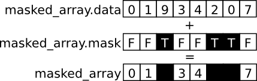
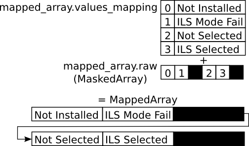
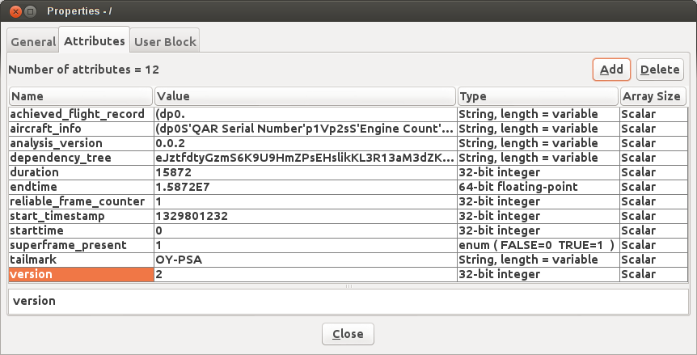
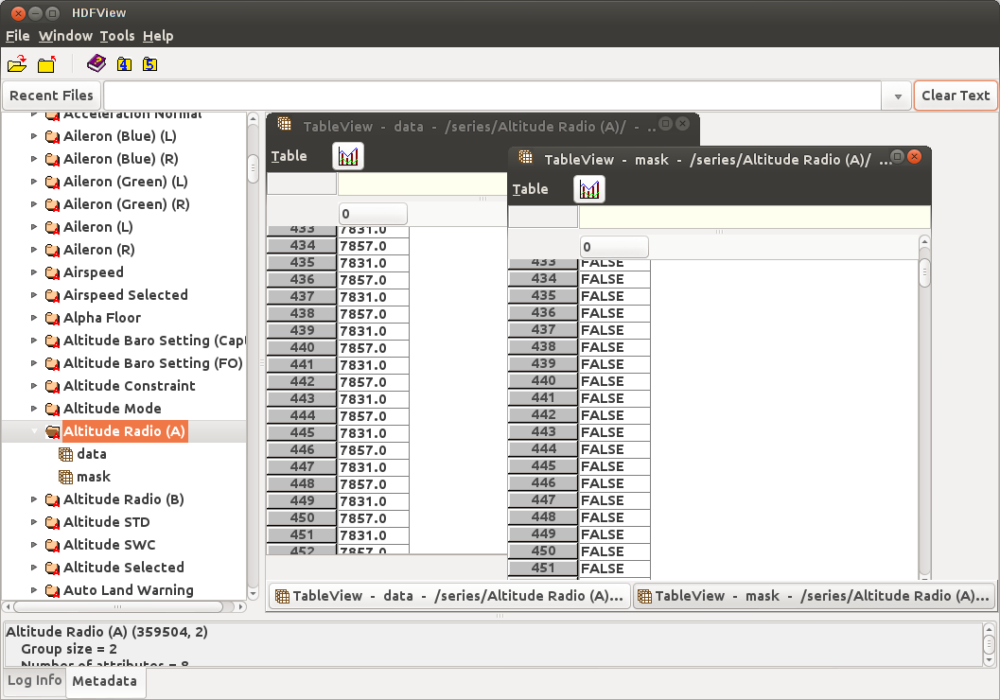
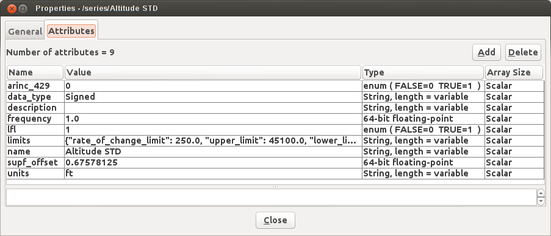

========
Overview
========

The `FlightDataAccessor` repository provides data types for accessing and manipulating flight data within `Hierarchical Data Format (HDF) <http://www.hdfgroup.org/HDF5/>`_ files.

------------
MaskedArrays
------------

`Parameter` data is stored within `numpy` `MaskedArrays`. `MaskedArrays` provide features for masking invalid sections of data.

A `MaskedArray` is comprised of two `numpy` arrays. The first array stores the parameter's data, typically as a series of floating point numbers, while the second stores the mask within a boolean array of equal size. If an index within the mask array is set to `True`, the corresponding index within the data array will be excluded from calculations.

.. code-block:: python

   >>> array = np.ma.masked_array([1, 2, 3, 4], mask=[False, False, True, False])
   >>> array
   masked_array(data = [1 2 -- 4],
                mask = [False False  True False],
          fill_value = 999999)
   >>> print array.sum()
   7

View the `numpy documentation on masked arrays <http://docs.scipy.org/doc/numpy/reference/maskedarray.html>`_ for more information.

------------
MappedArrays
------------

`MappedArray` is a subclass of `np.ma.MaskedArray` and implements a mapping between raw data values and state names. This type of array is used to store the data of `Discrete` and `Multi-state` parameters.

`Discrete` parameters record values of either 0 or 1 whereas `Multi-state` parameters record a variable number of states, each represented by a different integer value. The mapping of integer values to states is not consistent between different dataframes, engine types and aircraft. For instance, `Discrete` parameters may have inverted logic where 0 is `True` and 1 is `False`. By defining a consistent of list of state names for each parameter, and a mapping of raw data to state within each frame, `Discrete` and `Multi-state` parameters can be accessed consistently using MappedArrays.

.. code-block:: python

   >>> a = MappedArray([1, 2, 3, 4], values_mapping={1: 'Not Installed', 2: 'ILS Mode Fail',
   3: 'Not Selected', 4: 'ILS Selected'})
   >>> a
   masked_mapped_array(values = ['Not Installed' 'ILS Mode Fail' 'Not Selected' 'ILS Selected'],
                       data = [1 2 3 4],
                       mask = False,
                 fill_value = 999999,
             values_mapping = {1: 'Not Installed', 2: 'ILS Mode Fail', 3: 'Not Selected', 4: 'ILS Selected'})

   >>> a.raw
   masked_array(data = [1 2 3 4],
             mask = False,
       fill_value = 999999)

.. code-block:: python

   >>> np.ma.where(a == 'Not Installed')
   (array([0]),)

   >>> a[3] = 'Not Installed'
   >>> a
   masked_mapped_array(values = ['Not Installed' 'ILS Mode Fail' 'Not Selected' 'Not Installed'],
                      data = [1 2 3 1],
                      mask = False,
                fill_value = 999999,
            values_mapping = {1: 'Not Installed', 2: 'ILS Mode Fail', 3: 'Not Selected', 4: 'ILS Selected'})

   >>> a.raw
   masked_array(data = [1 2 3 1],
             mask = False,
       fill_value = 999999)

   >>> np.ma.where(a == 'Not Installed')
   (array([0, 3]),)

----------
Parameters
----------

The `Parameter` class within the `hdfaccess.parameter` module represents a parameter's data and associated information.

A `Parameter` object has the following attributes:

* `name` – The name of the parameter.
* `frequency` – The frequency/sample rate which the parameter is recorded at.
* `offset` – The offset of the parameter in seconds within a superframe.
* `units` – The unit of measurement the parameter is recorded in.
* `description` – A description of the parameter.
* `array` – A `MaskedArray` or `MappedArray` containing the parameter's data.
* `values_mapping` – Optional. If the parameter's array is a `MappedArray`, this attribute will contain `MappedArray`'s values mapping.

.. code-block:: python

   >>> param = Parameter('Longitude', frequency=2, offset=0.2375, units='deg',
       description='The east-west position of the aircraft in decimal degrees.',
       array=np.ma.masked_array([59.345, 59.346, 59.347]))
   >>> print param
   Longitude 2.0Hz 0.24secs
   >>> print param.array
   [ 59.345  59.346  59.347]

------------------------------
Hierarchical Data Format (HDF)
------------------------------

`HDF5` is the chosen format for storing flight data and associated information. The structure of an HDF file is similar to a filesystem. Container structures named `groups` which resemble directories may contain a number of datasets and subgroups. Datasets store multi-dimensional arrays.

.. code-block:: python

   >>> import h5py
   >>> hdf = h5py.File('flight.hdf5')
   >>> # Filesystem-like access.
   >>> print hdf['/series/Latitude']
   <HDF5 group "/series/Latitude" (3 members)>
   >>> # Alternatively, the file can be accessed like a multi-level dictionary.
   >>> print hdf['series']['Latitude']['data']
   <HDF5 dataset "data": shape (5888,), type "<f8">

`Groups` may also contain up to 64KB of key value attribute pairs.

--------
hdf_file
--------

The `hdf_file` class within the `hdfaccess.file` module provides a high-level interface to HDF files designed for saving and loading flight data. `hdf_file` implements a file-like interface.

.. code-block:: python

   >>> from hdfaccess.file import hdf_file
   >>> # HDF files can be opened using the with statement.
   >>> with hdf_file('flight.hdf5') as hdf:
   >>>     print hdf
   flight.hdf5 13.36MB (1055 parameters)
   >>> # HDF files can also be opened and closed manually.
   >>> hdf = hdf_file('flight.hdf5')
   >>> print hdf
   flight.hdf5 13.36MB (1055 parameters)
   >>> hdf.close()

`hdf_file` also implements a dictionary-like interface which saves and loads `Parameter` objects to and from the HDF file.

.. code-block:: python

   >>> print hdf.keys()
   ['Altitude Radio', 'Altitude STD']
   >>> # Load a parameter from a file.
   >>> # The entire dataset is loaded from the file to avoid manipulating data within the file.
   >>> alt_rad = hdf['Altitude Radio']
   >>> print alt_rad
   Altitude Radio 0.5Hz 1.50secs
   >>> print type(alt_rad)
   <class 'hdfaccess.parameter.Parameter'>
   >>> # Delete a parameter from a file.
   >>> del hdf['Altitude Radio']
   >>> print hdf.keys()
   ['Altitude STD']
   >>> # Save a parameter to a file.
   >>> hdf['Altitude Radio'] = alt_rad
   >>> print hdf.keys()
   ['Altitude Radio', 'Altitude STD']

The following properties are defined for an `hdf_file` object:

* `analysis_version` – The version of the `FlightDataAnalyzer` which processed this HDF file.
* `dependency_tree` – The dependency tree generated by the `FlightDataAnalyzer` for this HDF file.
* `duration` – Duration of the flight data stored within the HDF file in seconds.
* `reliable_frame_counter` – Whether or not the frame which was used to create the HDF file had a reliable `Frame Counter` parameter.
* `start_datetime` – The start datetime of the data stored within the HDF file.
* `superframe_present` – Whether or the frame which was used to create the HDF file had a superframe counter.
* `version` – The version of downsampling applied to the HDF file.

A number of methods are defined for an hdf_file object:

* `search` – Search for a parameter by partial string match.
* `get_matching` – Search for parameters which match a regular expression.
* `lfl_keys` – Returns a list of parameter names which came from the logical frame layout.
* `derived_keys` – Returns a list of parameter names which were derived by the `FlightDataAnalyzer`.
* `get_or_create` – Load a parameter from the HDF file. If the parameter does not exist, it will be created.
* `get_params` – Loads multiple parameters specified by a list of parameter names.

-----------------------
hdf_file under the hood
-----------------------

This section describes how the `hdf_file` class stores flight data within the HDF file format. This low-level information is not required when using the `hdf_file` class as the implementation is abstracted. This section requires an understanding of the `Hierarchical Data Format <http://en.wikipedia.org/wiki/Hierarchical_Data_Format>`_ and the `h5py <http://www.h5py.org/docs/>`_ library.

The underlying `h5py.File` object can be accessed through `hdf_file`'s hdf attribute.

.. code-block:: python

   >>> from hdfaccess.file import hdf_file
   >>> with hdf_file('flight.hdf5') as hdf:
   >>>     print hdf.hdf
   <HDF5 file "flight.hdf5" (mode r+)>

Properties
^^^^^^^^^^

The `hdf_file` class defines a number of properties which are stored within the HDF file as root level attributes.

.. code-block:: python
   
   >>> hdf.superframe_present = True
   >>> print dict(hdf.hdf.attrs)
   {u'superframe_present': True}
   >>> print hdf.superframe_present
   True

Some properties are converted to and from `Python` types automatically for convenience.

.. code-block:: python
   
   >>> import datetime
   >>> hdf.start_datetime = datetime.datetime(2013, 2, 22, 5, 6, 10)
   >>> print dict(hdf.hdf.attrs)
   {u'start_timestamp': 1361509570}
   >>> print hdf.start_datetime
   datetime.datetime(2013, 2, 22, 5, 6, 10)

Dictionaries are stored in `JSON <http://www.json.org/>`_ format for interoperability.

.. Currently excluded from documentation as it's confusing. To overcome the limitation whereby the attributes of a group cannot exceed 64KB, large dictionaries such as the dependency tree are compressed and base64 encoded when saved to the file.
   
   code-block:: python
   
   >>> hdf.dependency_tree = [{'adjacencies': [{'data': {},
                                                'nodeTo': 'Event Marker'},
                              {'data': {}, 'nodeTo': 'Airborne'}],
                               'data': {'color': '#bed630',
                                        'label': '14: Event Marker Pressed'},
                               'id': 'Event Marker Pressed',
                               'name': '14: Event Marker Pressed'}]
   >>> print dict(hdf.hdf.attrs)
   {u'dependency_tree': 'eJx9jrEOwjAMRH/FMmsHEIihGwMjEgNb1cGJPQSCIzkVS9R/...zS0c5\n'}
   >>> print hdf.dependency_tree
   [{'adjacencies': [{'data': {}, 'nodeTo': 'Event Marker'},
                     {'data': {}, 'nodeTo': 'Airborne'}],
                      'data': {'color': '#bed630', 'label': '14: Event Marker Pressed'},
                      'id': 'Event Marker Pressed',
                      'name': '14: Event Marker Pressed'}]

Parameters
^^^^^^^^^^

Parameters are stored underneath a group named `series`.

.. code-block:: python

   >>> print hdf.hdf.keys()
   [u'series']
   >>> print hdf.hdf['series'].keys()
   [u'Altitude Radio', u'Altitude STD']

A parameter is stored as a group containing attributes and two datasets – `data` and `mask`. Datasets are stored with gzip compression level 6 which is transparently built-in to the HDF5 library.

.. code-block:: none
   
   /
   |-- /series
   |   -- /series/"Altitude Radio"
   |      -- /series/"Altitude Radio"/data
   |      -- /series/"Altitude Radio"/mask

Example code accessing the parameter group and its datasets.

.. code-block:: python
   
   >>> print hdf.hdf['series']['Altitude Radio']
   <HDF5 group "/series/Altitude Radio" (3 members)>
   >>> print hdf.hdf['series']['Altitude Radio'].keys()
   [u'data', u'levels', u'mask']
   >>> print hdf.hdf['series']['Altitude Radio']['data']
   <HDF5 dataset "data": shape (4,), type "<f8">
   >>> print hdf.hdf['series']['Altitude Radio']['mask']
   <HDF5 dataset "mask": shape (4,), type "|b1">

A `MaskedArray` is comprised of two arrays which are stored separately within the `data` and `mask` datasets. The `data` dataset stores the recorded values of the parameter, typically as an array of 64-bit floating point numbers, while the `mask` dataset stores the boolean mask array.

.. code-block:: python
   
       # Read datasets into memory.
   >>> data = hdf.hdf['series']['Altitude Radio']['data'][:]
   >>> mask = hdf.hdf['series']['Altitude Radio']['mask'][:]
   >>> data
   array([ 120.  121.  122.  123.])
   >>> mask
   array([ False  False  True  False])
   >>> import numpy as np
   >>> np.ma.masked_array(data, mask=mask)
   masked_array(data = [ 120.  121.  --  123.],
                mask = [ False  False  True  False],
         fill_value = 1e+20)
       # This process is abstracted when a Parameter object is loaded by hdf_file.
   >>> alt_rad = hdf['Altitude Radio']
   >>> print alt_rad
   Altitude Radio 0.5Hz 1.50secs
   >>> alt_rad.array
   masked_array(data = [ 120.  121.  --  123.],
                mask = [ False  False  True  False],
         fill_value = 1e+20)

Information about a parameter is stored within the attributes of the parameter group.

.. code-block:: python
   
   >>> print dict(f['series']['Latitude'].attrs)
   {u'arinc_429': False,
    u'data_type': 'Signed',
    u'description': 'The east-west position of the aircraft in decimal degrees.',
    u'frequency': 1.0,
    u'lfl': True,
    u'name': 'Latitude',
    u'supf_offset': 0.2265625,
    u'units': 'deg'}

Caching within the hdf_file class
^^^^^^^^^^^^^^^^^^^^^^^^^^^^^^^^^

Caching Parameters
""""""""""""""""""

When a `Parameter` object is loaded from the HDF file, the entire data and mask datasets are read from the file and combined to create the `Parameter`'s array attribute. To speed up loading of the parameters which have already been read from the file, an optional argument `cache_param_list`, a list of parameter names to be cached, can be provided to `hdf_file`'s constructor.

.. code-block:: python
   
   >>> from timeit import timeit
   >>> # Loading the parameter for the first time.
   >>> timeit("hdf['Acceleration Normal']",
              setup="from hdfaccess.file import hdf_file; hdf = hdf_file('flight.hdf5')",
              number=100)
   1.5289490222930908
   >>> # Loading the parameter after it has been cached.
   >>> timeit("hdf['Acceleration Normal']",
       setup="from hdfaccess.file import hdf_file; hdf = hdf_file('flight.hdf5', cache_param_list=['Acceleration Normal']); hdf['Acceleration Normal']",
       number=100)
   0.09475302696228027

Caching Parameter names
"""""""""""""""""""""""

Retrieving the contents of a group within `h5py` is much slower than native Python types, therefore this list is cached on the `hdf_file` object and updated when parameters are saved or deleted.

.. code-block:: python
   
   >>> from timeit import timeit
   >>> print len(hdf.keys())
   1043
   >>> timeit("hdf.hdf['series'].keys()",
              setup="from hdfaccess.file import hdf_file; hdf_file('flight.hdf5')",
              number=100)
   7.203955888748169
   >>> timeit("hdf.keys()",
              setup="from hdfaccess.file import hdf_file; hdf = hdf_file('flight.hdf5')",
              number=100)
   0.06666207313537598
